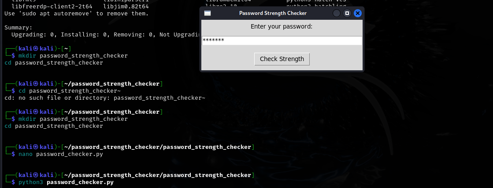
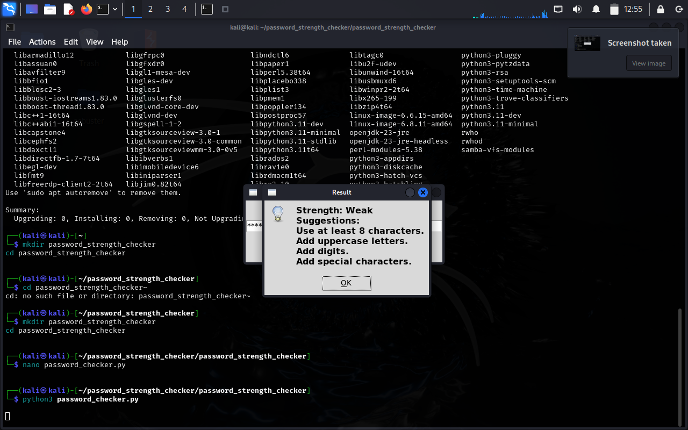
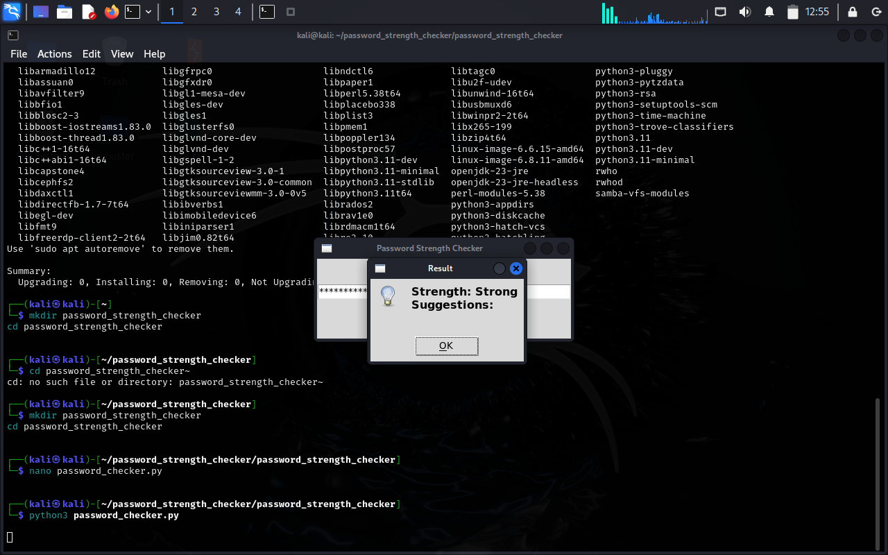

# 🔐 Password Strength Checker

## 📌 Project Title
**Password Strength Checker using Python (Rule-Based + GUI)**

---

## 📌 Short Description
A lightweight, GUI-based Python tool that evaluates the strength of a password using rule-based logic. It provides real-time feedback and suggestions, helping users create secure, complex passwords.

---

## 🚀 Features
- ✅ Evaluates password strength as **Weak**, **Moderate**, or **Strong**
- 📏 Checks for:
  - Minimum length
  - Uppercase & lowercase characters
  - Digits & special characters
  - Common dictionary words (via NLTK)
- 🖥️ Simple GUI using Tkinter
- 💬 Instant feedback via popup suggestions

---

## 🛠️ Technologies Used
- Python 3
- Tkinter (GUI)
- Regex (`re` module)
- NLTK (`words` corpus for dictionary checks)
- Kali Linux (testing platform)

---

## ▶️ How to Run

### 🧰 Step 1: Install Dependencies

```bash
sudo apt update
sudo apt install python3 python3-pip python3-tk -y
pip3 install nltk
python3
```
### Step 2: Download NLTK Corpus
```
>>> import nltk
>>> nltk.download('words')
>>> exit()
```
Step 3: Run the Application
```
python3 password_checker.py
```
### 💻 GUI in Action
| GUI Window | Phishing Result |
|------------|------------------|
|  |  |   |
